# Архитектура приложения AntiSocial iOS

## 1. Система аутентификации

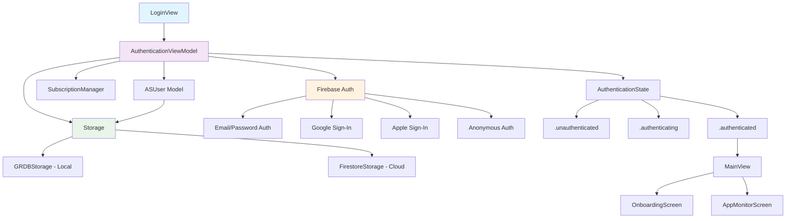

## 2. Система блокировки приложений

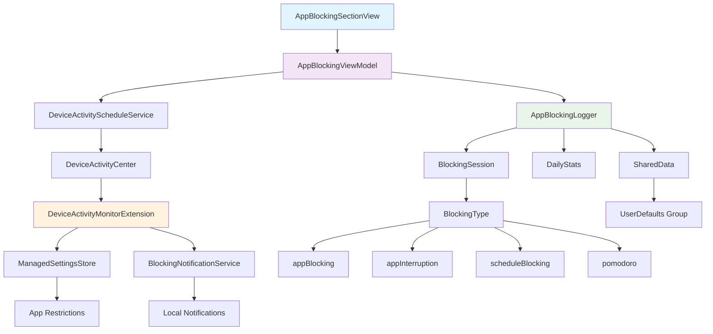

## 3. Система Pomodoro

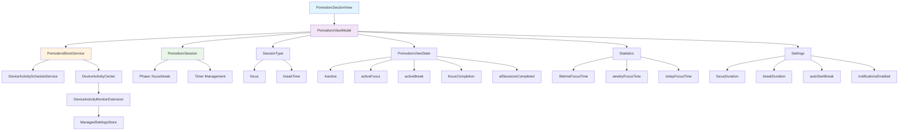

## 4. Система расписания блокировок

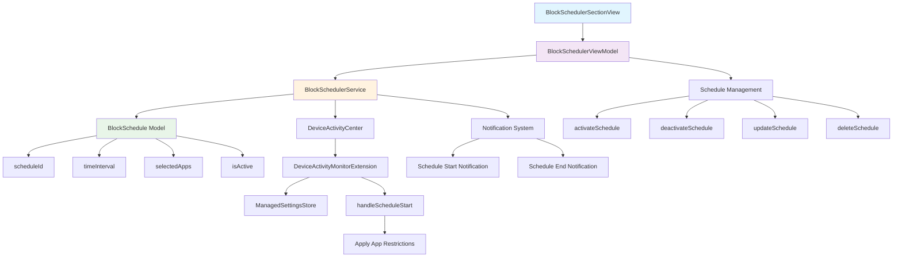

## 5. Система хранения данных

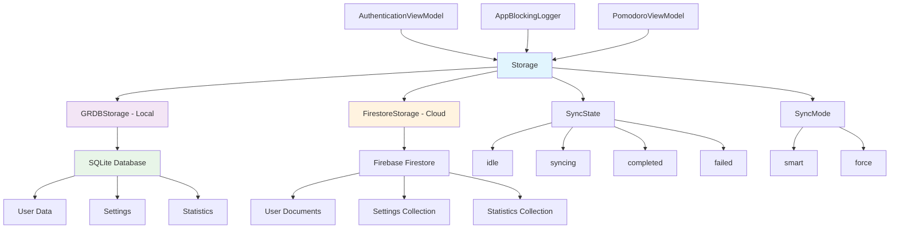

## 6. Основной поток приложения

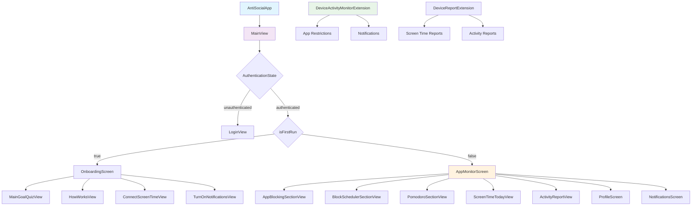

## 7. Система уведомлений

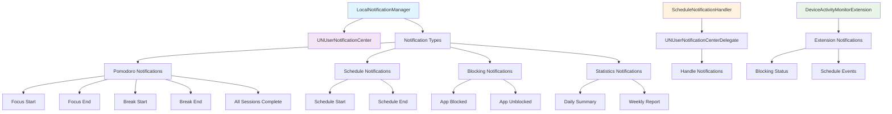

## 8. Система статистики и отчетов

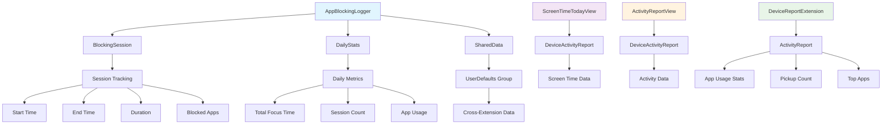

## 9. Система подписок и монетизации

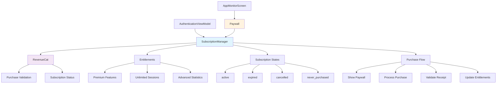

## 10. Архитектура расширений

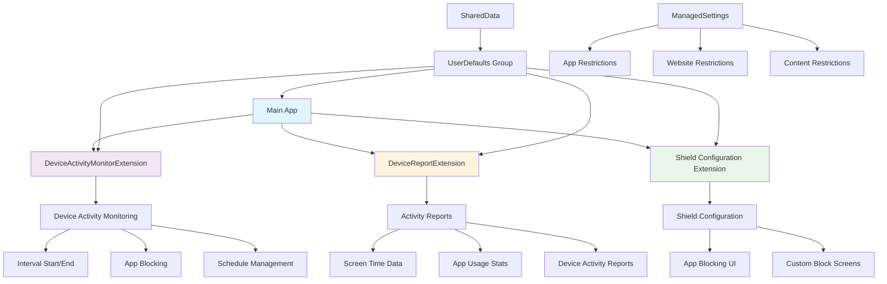

## 11. Система FamilyControls и ManagedSettings

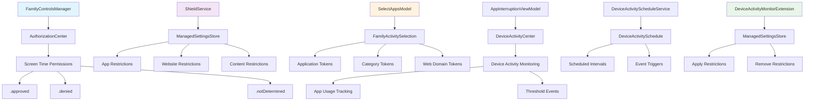

## 12. Система SharedData и межпроцессного взаимодействия

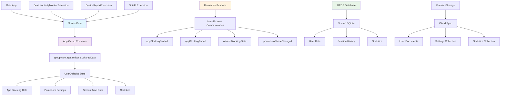

## 13. Детальная архитектура DeviceActivityMonitorExtension

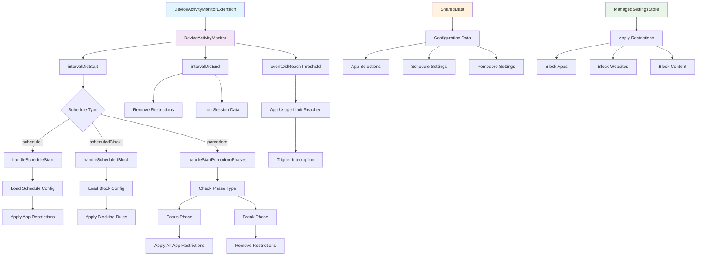

## 14. Система Shield Configuration Extension

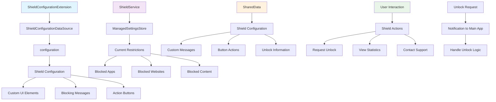

## 15. Система DeviceReportExtension

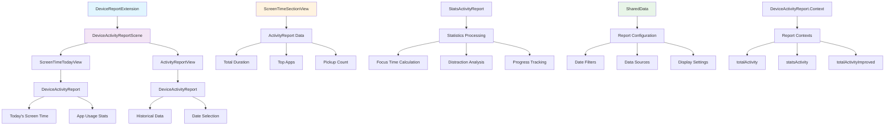
